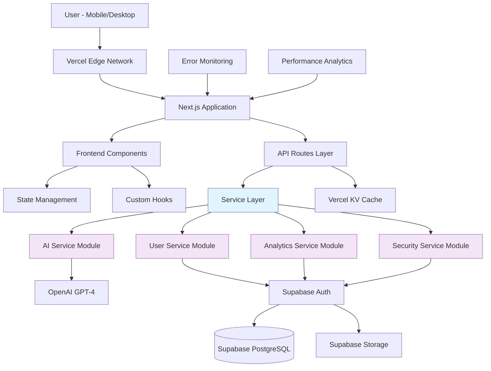

# Dating Help AI Fullstack Architecture Document

## Introduction

This document outlines the complete fullstack architecture for **Dating Help AI**, including backend systems, frontend implementation, and their integration. It serves as the single source of truth for AI-driven development, ensuring consistency across the entire technology stack.

This unified approach combines what would traditionally be separate backend and frontend architecture documents, streamlining the development process for modern fullstack applications where these concerns are increasingly intertwined.

### Starter Template Analysis

**Current State:** The project appears to be built from a **Next.js starter template** with extensive customization for AI-powered dating assistance features. Key observations:

- **Framework:** Next.js 15.2.4 with React 19
- **UI Framework:** Extensive Radix UI component library integration
- **Styling:** Tailwind CSS with shadcn/ui components
- **Database:** Supabase integration with typed schemas
- **AI Integration:** Custom OpenAI service wrapper
- **Authentication:** Supabase Auth system

**Constraints Identified:**
- Must maintain Supabase backend integration
- OpenAI API dependency for core functionality
- Existing component library structure
- Current deployment on Vercel platform

### Change Log

| Date | Version | Description | Author |
|------|---------|-------------|---------|
| 2025-08-31 | v1.0 | Initial fullstack architecture design | Winston (Architect) |

## High Level Architecture

### Technical Summary

Dating Help AI employs a **performance-optimized monolithic Next.js architecture** with intelligent service modularization, deployed on Vercel's edge network for global low-latency access. The frontend leverages React 19 with Tailwind CSS and shadcn/ui components for responsive mobile-first experiences, while the backend utilizes Next.js API routes with a well-structured service layer for AI conversation generation, screenshot analysis, and user management. Key integration points include OpenAI GPT-4 for conversation intelligence, Supabase for authentication/database/storage, and a modular service architecture that separates concerns while maintaining deployment simplicity. The infrastructure emphasizes edge computing and CDN optimization to ensure sub-200ms response times for dating app users who expect instant AI assistance, achieving PRD goals through strategic caching, intelligent API design, and mobile-optimized user experiences.

### Platform and Infrastructure Choice

**Platform:** Vercel (with Edge Runtime optimization)  
**Key Services:** 
- Vercel Edge Functions for AI processing
- Supabase Database (PostgreSQL) with connection pooling
- Supabase Auth with enhanced security policies
- Supabase Storage for screenshot handling
- Vercel Analytics for performance monitoring
- Vercel KV for Redis-like caching

**Deployment Host and Regions:** Global edge deployment with primary regions: US-East, EU-West, Asia-Pacific for optimal dating app user distribution

### Repository Structure

**Structure:** Enhanced Monorepo within Next.js framework  
**Monorepo Tool:** Native Next.js with npm workspaces for shared utilities  
**Package Organization:** 
- `/lib` - Core services and utilities (modularized)
- `/components` - UI components with clear hierarchy
- `/app` - Next.js app router structure
- `/types` - Shared TypeScript definitions
- `/hooks` - Custom React hooks
- `/services` - Business logic layer (new modular approach)

### High Level Architecture Diagram

### Architectural Patterns

- **Modular Monolith:** Single deployment with clear module boundaries - _Rationale:_ Maintains deployment simplicity while achieving organizational goals
- **Service Layer Pattern:** Separated business logic from API routes - _Rationale:_ Improves testability and enables better error handling
- **Repository Pattern:** Abstract data access with Supabase clients - _Rationale:_ Enables testing and maintains clean separation of concerns
- **Edge-First Architecture:** Leverage Vercel's edge runtime - _Rationale:_ Critical for dating app performance where milliseconds matter
- **Component-Based UI:** Hierarchical React components with shadcn/ui - _Rationale:_ Maintains current investment while improving organization
- **Middleware Pattern:** Request/response interceptors for auth and logging - _Rationale:_ Centralized security and monitoring
- **Circuit Breaker Pattern:** AI service resilience - _Rationale:_ Prevents cascade failures when OpenAI services are slow
- **Caching Strategy Pattern:** Multi-layer caching for performance - _Rationale:_ Essential for sub-200ms response time goals

## Tech Stack

| Category | Technology | Version | Purpose | Rationale |
|----------|------------|---------|---------|-----------|
| Frontend Language | TypeScript | ^5.0 | Type-safe development | Critical for large codebase maintainability and AI service integration |
| Frontend Framework | Next.js | 15.2.4 | Full-stack React framework | Proven performance, excellent Vercel integration, API routes |
| UI Component Library | shadcn/ui + Radix UI | Latest | Accessible component system | Current investment, excellent mobile UX, accessibility built-in |
| State Management | React Hooks + Zustand | ^4.4.0 | Client state management | Lightweight, performant, better than current hook-only approach |
| Backend Language | TypeScript | ^5.0 | Unified language stack | Single language reduces complexity, shared types |
| Backend Framework | Next.js API Routes | 15.2.4 | Serverless API layer | Seamless integration, edge runtime support |
| API Style | REST + tRPC | tRPC ^10.0 | Type-safe API calls | Eliminates API contract mismatches, excellent DX |
| Database | Supabase PostgreSQL | Latest | Primary data store | Current investment, excellent performance, built-in auth |
| Cache | Vercel KV (Redis) | Latest | Performance caching | Sub-200ms response times, edge-compatible |
| File Storage | Supabase Storage | Latest | Screenshot/media storage | Integrated with database, CDN-backed |
| Authentication | Supabase Auth | Latest | User management | Current investment, OAuth providers, security policies |
| Frontend Testing | Vitest + Testing Library | ^1.0.0 | Component testing | Faster than Jest, better Vite integration |
| Backend Testing | Vitest + Supertest | ^1.0.0 | API testing | Consistent testing stack |
| E2E Testing | Playwright | ^1.40.0 | End-to-end testing | Best mobile testing, dating app workflows |
| Build Tool | Next.js Build | 15.2.4 | Application bundling | Optimized for Vercel deployment |
| Bundler | Webpack (Next.js) | Latest | Module bundling | Built-in optimization, tree shaking |
| IaC Tool | Vercel CLI | Latest | Infrastructure management | Simple deployment, environment management |
| CI/CD | GitHub Actions | Latest | Automated deployment | Free tier, excellent GitHub integration |
| Monitoring | Vercel Analytics + Sentry | Latest | Performance + error tracking | Critical for dating app user experience |
| Logging | Pino | ^8.0.0 | Structured logging | High performance, edge-compatible |
| CSS Framework | Tailwind CSS | ^3.4.17 | Utility-first styling | Current investment, excellent mobile-first design |

## Implementation Plan

The following sections outline the step-by-step implementation of the modular architecture rebuild.
